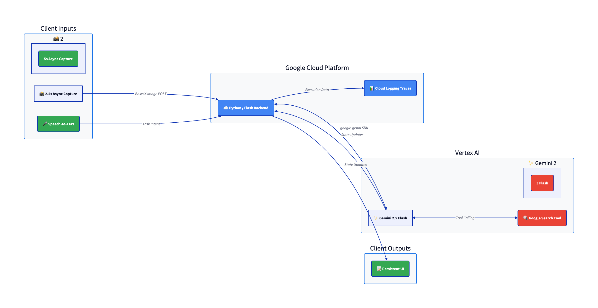

# 👁️ OpticFlow: Autonomous Visual AI Auditor

Built for the **Gemini Live Agent Challenge** (Live Agents Track).

OpticFlow is a real-time, hands-free multimodal AI assistant. Unlike traditional "pull" AI chatbots where users must type queries and upload photos manually, OpticFlow is a "push" system. It utilizes a continuous visual audit loop to watch a user's physical actions in the real world, proactively correcting mistakes, issuing next steps, and fetching manuals or replacement parts autonomously.

## 🏗️ System Architecture

* **Frontend:** Mobile-first Augmented Reality (AR) HUD built with vanilla HTML/JS/CSS (100dvh optimized).
* **Backend:** Python Flask API containerized via Docker.
* **AI Engine:** Google Vertex AI (`gemini-2.5-flash`) utilizing the new `google-genai` SDK.
* **Grounding:** Google Search tools for real-time dynamic data retrieval.
* **Infrastructure:** Google Cloud Run (Compute) and Google Cloud Logging (Telemetry).

## 🏆 Engineering Highlights & Hackathon Value

1. **Hardware Collision Management (The Mutex Pattern):** Web browsers inherently struggle with simultaneous heavy loads on the Microphone (STT), Speaker (TTS), and Camera (WebRTC). OpticFlow uses a custom JavaScript "Traffic Light" State Machine to seamlessly interrupt background visual polling when voice commands are detected, guaranteeing zero UI freezing or API pileups.
2. **Bifocal Resolution Routing:** To optimize bandwidth and processing speed, background visual audits utilize highly compressed 50% scale images. When a user explicitly speaks to the AI (e.g., asking it to read a model number or label), the system dynamically switches to 100% resolution for high-fidelity OCR.
3. **Dynamic Timeouts & Proactive Help:** The system tracks user idle ticks. If a user struggles with a physical step for ~45 seconds without making visual progress, the AI proactively asks if they need help. After 10 minutes of total inactivity, the system issues a warning and gracefully shuts down the camera and microphone.
4. **Dynamic Tool Routing:** The backend leverages Vertex AI with Automatic Function Calling. The AI independently decides whether to perform a silent visual inspection or trigger Google Search Grounding to scrape the web for purchase links and manuals.
5. **Natural Language Kill Switch:** No hardcoded "bye" buttons. The AI natively detects when a user is finished and injects a hidden `[SHUTDOWN_CMD]` into its response, allowing the frontend to gracefully power down the hardware.

## ⚙️ How to Run Locally

1. Clone the repository.
2. Install dependencies: `pip install -r requirements.txt`
3. Set your Google Cloud Project ID in `main.py`.
4. Run the server: `python main.py`
5. Access the HUD via your browser at `http://localhost:8080` (Note: Browsers block webcam access on non-secure IPs. Use `localhost` or an HTTPS tunnel).

## ☁️ How to Deploy to Google Cloud (Production)

We have included an automated bash script to handle containerization and deployment to Google Cloud Run using a standard Python 3.12 slim image.

1. Ensure you have the `gcloud` CLI installed and authenticated.
2. Make the script executable: `chmod +x deploy.sh`
3. Run the deployment pipeline: `./deploy.sh`
4. The script will automatically build the source, deploy it to `us-central1`, and output your live secure HTTPS URL.

## 🧪 Reproducible Testing Instructions for Judges

To experience OpticFlow's dynamic state machine, follow these exact steps on a mobile device using our live deployment URL.

**1. Initialization & Identification**
* Open the OpticFlow web interface. Allow camera and microphone permissions.
* Point your camera at a common physical object (e.g., a coffee machine or a router). 
* Click **INITIALIZE SYSTEM**. The system will perform a high-resolution initial scan, identify the object, and speak out loud (e.g., "I see a Nespresso machine. Is this correct?").

**2. Dynamic Procedure Generation (The 1-Step Rule)**
* Reply naturally: *"Yes, show me how to brew a coffee."*
* The AI will dynamically fetch the correct procedure using Google Search. Instead of reading the whole manual, it will give you **only the first step** (e.g., "Fill the water tank").

**3. The "Happy Path" (State Verification)**
* Perform the physical action. **Do not touch the screen or speak.**
* Wait for the background audit loop (runs automatically every 8.5 seconds). The AI will visually verify the physical end-state, log it in the UI, and read the next step out loud ("Great job. Now open the machine head.").

**4. The "Deviation" Test (Hazard Enforcement - CRITICAL TEST)**
* **Do NOT perform the next step correctly.** Instead, perform an out-of-sequence action or grab the wrong part.
* Wait for the silent background audit.
* **The Magic Moment:** The AI will issue a verbal correction, explicitly telling you that you are deviating from the required procedure.

**5. Proactive Help & Bifocal OCR**
* Hold a label or serial number up to the camera and ask: *"Can you read this model number?"* The system will instantly switch to 100% resolution to perform OCR.
* Stand completely still for 45 seconds. The AI will notice you are stuck and proactively ask if you need clarification.

**6. Graceful Shutdown**
* Say: *"I'm all done for today, thanks."*
* The AI will say goodbye and the UI will automatically sever the camera and microphone connections without a physical screen tap.